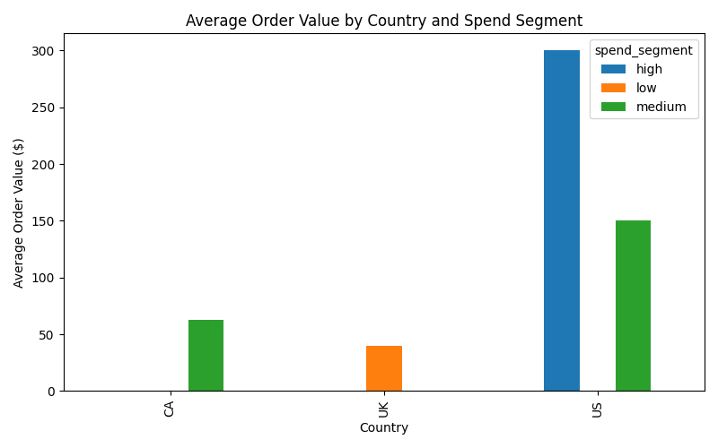
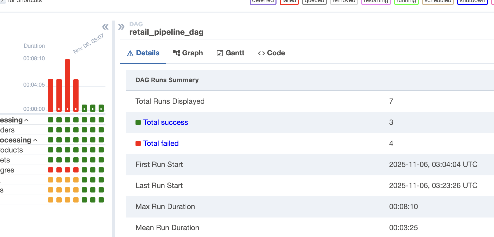
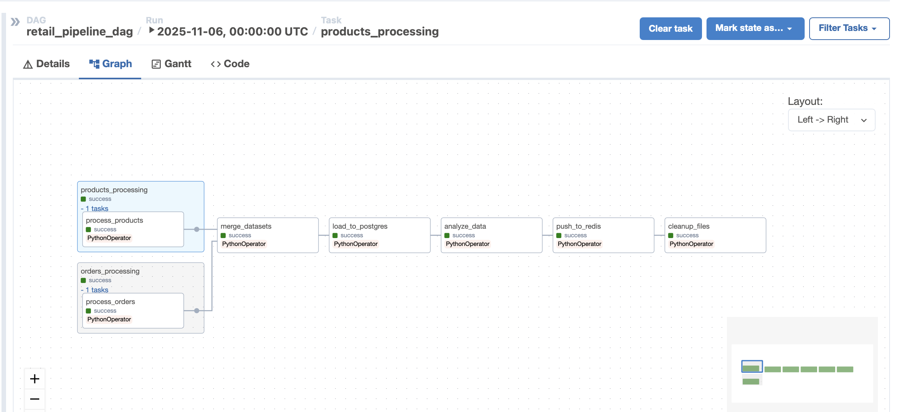

# IDS-706 Airflow Pipeline: Retail Orders & Products Analysis

## Overview

This project implements a **retail ETL pipeline** using **Apache Airflow**. The pipeline extracts, transforms, and loads retail order and product data, performs analysis, generates visualizations, and caches insights in Redis for quick access.  

**Key Features**:
- Automated ETL workflow with Airflow
- PostgreSQL integration for persistent storage
- Redis caching for quick metrics retrieval
- Analytics visualizations using Matplotlib
- Cleanup of intermediate files to save storage


---

## DAG Workflow

### Task Groups and Sequence

1. **Parallel Processing**
   - `orders_processing` → Processes orders data
   - `products_processing` → Processes products data

2. **Sequential Processing**
   - `merge_datasets` → Combine orders and product data
   - `load_to_postgres` → Store aggregated stats in PostgreSQL
   - `analyze_data` → Generate analytics charts
   - `push_to_redis` → Cache metrics in Redis
   - `cleanup_files` → Delete intermediate CSV files

---

### Detailed Task Descriptions

#### 1️⃣ Process Orders
- **Function**: `process_orders`
- **Input**: `data/orders.csv`
- **Transformations**:
  - Convert `Date Order was placed` and `Delivery Date` to datetime
  - Calculate `profit` = `Total Retail Price` − (`Cost Price Per Unit` × `Quantity Ordered`)
  - Extract `order_month` from order date
- **Output**: `data/processed/orders_clean.csv`

#### 2️⃣ Process Products
- **Function**: `process_products`
- **Input**: `data/product-supplier.csv`
- **Output**: `data/processed/products_clean.csv`

#### 3️⃣ Merge Datasets
- **Function**: `merge_datasets`
- **Inputs**: `orders_clean.csv`, `products_clean.csv`
- **Transformations**:
  - Left join on `Product ID`
  - Group by `Customer ID` & `Product Group`
  - Aggregate metrics: `total_spent`, `total_profit`, `num_orders`, `avg_order_value`
- **Output**: `data/processed/customer_product_stats.csv`

#### 4️⃣ Load to PostgreSQL
- **Function**: `load_to_postgres`
- **Action**:
  - Loads customer-product stats to PostgreSQL table `fact_customer_products`
  - Requires Airflow connection `local_postgres`

#### 5️⃣ Analyze Data
- **Function**: `analyze_data`
- **Action**:
  - Generates bar chart comparing `avg_spent` and `avg_profit` per `Product Group`
- **Output**: `analysis/spend_profit_by_group.png`

#### 6️⃣ Push to Redis
- **Function**: `push_to_redis`
- **Action**:
  - Aggregates number of customers and average spend per product group
  - Stores in Redis keys like `product_group:{Product Group}`
  - Stores last update timestamp in `last_update`
- **Requirements**: Redis running at `redis:6379`

#### 7️⃣ Cleanup Files
- **Function**: `cleanup_files`
- **Action**:
  - Deletes intermediate CSVs:
    - `orders_clean.csv`
    - `products_clean.csv`
    - `customer_product_stats.csv`

---

## Setup Instructions

### Install Prerequisites
- Python 3.8+
- Docker & Docker Compose environment
- Apache Airflow
- PostgreSQL
- Redis

### Install Python Packages
```bash
pip install apache-airflow
pip install apache-airflow-providers-postgres
pip install pandas
pip install matplotlib
pip install redis
```

### Configure PostgreSQL in Airflow
```bash
airflow connections add 'local_postgres' \
--conn-type 'postgres' \
--conn-host 'localhost' \
--conn-schema 'your_database' \
--conn-login 'your_user' \
--conn-password 'your_password' \
--conn-port 5432
```

### Start Airflow
### Using Docker Compose
```bash
docker-compose up -d
```

### Enable DAG
1. Open Airflow UI: http://localhost:8080
2. Toggle retail_pipeline_dag ON
3. Trigger manually or wait for scheduled run

### Monitoring & Debugging 
### List DAGs
```bash
airflow dags list
```

### Check DAG state
```bash
airflow dags state retail_pipeline_dag
```
#### View task logs
```bash
airflow tasks logs retail_pipeline_dag process_orders 2024-11-05
```

### Outputs

| Output Type          | File / Location                          |
|----------------------|----------------------------------------|
| Processed Data (CSV) | `data/processed/*.csv`                  |
| Analytics Chart      | `analysis/avg_order_value_by_segment.png`|
| Database Table       | `fact_customer_products` in PostgreSQL  |
| Redis Cache          | `product_group:{group}`, `last_update`  |
 
 ---

### Visualisation- 
"Note: Some countries do not display all spend segments because no data was available for those categories."



---

### Screenshots of Dag and Airflow pipeline functioning- 



### Future Scope

1. **Real-Time Data Processing & Scalability**  
   - Integrate streaming data sources (Kafka, AWS Kinesis, etc.) to process orders and product updates in real-time.  
   - Use **PySpark** for distributed processing of large datasets, enabling faster and more scalable ETL pipelines.

2. **Advanced Analytics & Machine Learning**  
   - Implement predictive analytics to forecast sales, identify high-value customers, or recommend products, turning historical data into actionable business insights.


